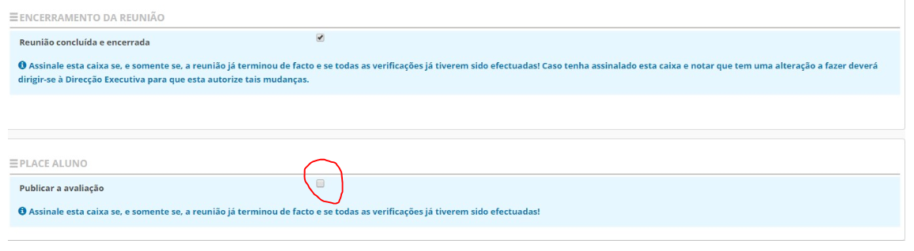
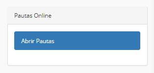

# Avaliação 

## Publicar a avaliação no Place Aluno. 

A Plataforma Place disponibilizou uma nova aplicação designada como Place Aluno. Esta visa manter os encarregados de educação informados sobre os diversos assuntos inerentes à educação dos seus educandos. 

No que diz respeito à avaliação é necessário que o diretor de turma autorize a publicação da avaliação na nova aplicação após o término das reuniões de avaliação. 

A validação para publicar a avaliação no Place Aluno está abaixo da marcação da reunião concluída e encerrada. 

Após a validação ou não do DT, a Direção Executiva deve abrir as Pautas Online, dando visibilidade aos encarregados de educação, das avaliações lançadas e autorizadas a ser publicadas no Place Aluno. 

> [!IMPORTANT]  
> O DT que não autorize a publicação das notas, após a abertura das pautas online por parte da direção executiva, não serão visíveis na aplicação para os encarregados de educação. 

Salientamos que a informação é visualizada em tempo real sempre que é atualizada pelas escolas.

