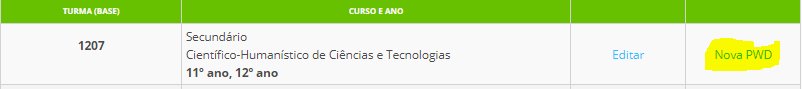
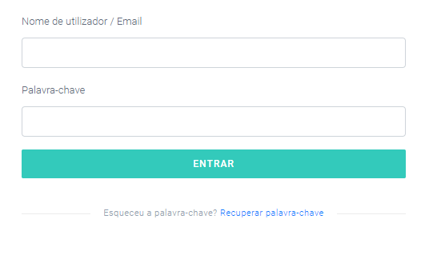
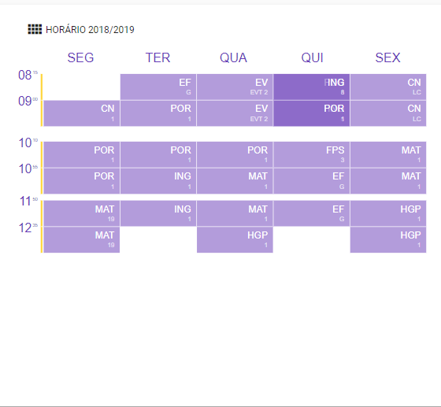
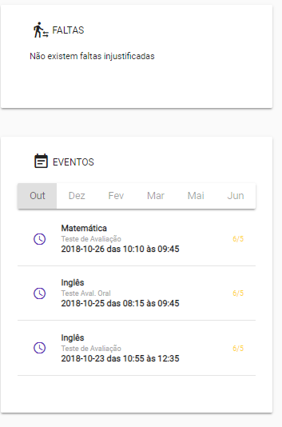

# Acesso ao Aluno

Os alunos com idades superiores a 13 anos, que frequentem estabelecimentos de ensino na RAM, devem solicitar o seu **código de acesso** para a nova aplicação na secretaria da escola ou junto ao diretor de turma (DT).
 
**A escola** deve aceder: 

1. Ir ao separador **alunos**
2. Confirmar os dados do aluno
3. Clicar em **nova PWD**

Desta forma, é gerado um código pessoal e intransmisivel, onde o aluno deve usá-lo para criar a sua conta no Place Aluno. 

## Aceder a Aplicação

Para criar conta o aluno deve aceder:  

[versão web](https://place.madeira.gov.pt/placealuno) ou através de aplicações móveis para [Android](http://bit.ly/PlaceAlunoDroid) e [iOS](http://bit.ly/PlaceAlunoiOS), ou pesquisando pelo nome da aplicação na Play Store e App Store, respetivamente.

No primeiro acesso deve:

**1º passo**: Criar conta

**2º passo** – Validar código

Deve inserir o código disponibilizado pela escola.

**3º passo**: – Definir nome do **utilizador e palavra-passe**

Neste campo, é importante escolher o **utilizador e palavra-passe** e que tenha a consciência que serão sempre necessários quando quiser aceder a aplicação. 

Após a criação da conta (apenas uma vez) deve entrar utilizando o utilizador e palavra-passe definidas para entrar na aplicação. 

Quando o aluno entrar na aplicação consegue visualizar:

1. **Ficha pessoal do aluno**

2. **O Horário**

3. **Eventos** importantes do aluno

a) Faltas e testes marcados

 

> [!CAUTION]  
> Neste acesso é importante que os alunos usem somente os seus dados ( e não alguns dados do encarregado de educação).
