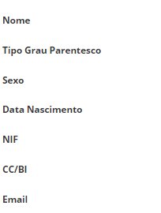
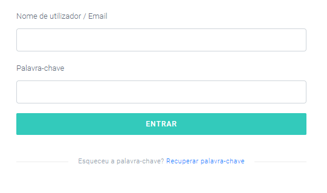
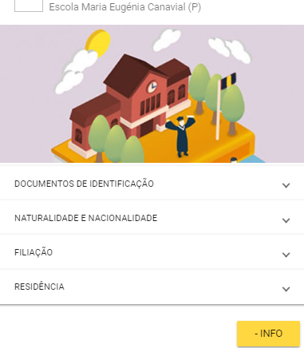
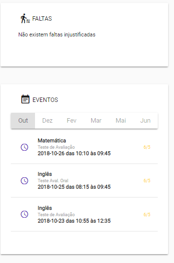

# Acesso ao Encarregado de educação 

Os encarregados de educação que queiram ter acesso a aplicação, devem dirigir-se à escola e solicitar o código de acesso do encarregado de educação.

Para que o acesso seja feito corretamente, a **escola deve**:
 
1. Ir a **aluno**

2. Separador **encarregado de educação** 

3. Preencher os dados obrigatórios do encarregado de educação:

4. **Dar acesso** 

Ao clicar neste item, **vai gerar um código** de acesso, o qual deve fornecer a cada encarregado de educação que solicite. 

> [!IMPORTANT]  
> Em caso de esquecimento da palavra-passe, pode clicar em **nova palavra-passe**. No caso de haver mudança do encarregado de educação, a escola deve clicar em **revogar acesso** ao anterior encarregado de educação. A qualquer momento, caso seja necessário e devidamente justificado, pode criar um **novo encarregado de educação**. 

> [!NOTE]  
> Os encarregados de educação devem pedir o acesso nos serviços administrativos da escola e atualizar os dados do encarregado de educação nas diferentes escolas onde tenham filhos a frequentar (caso tenham mais que um filho). 

## Acesso à aplicação 

Quando o encarregado de educação tiver em sua posse o código de acesso deve aceder:  

[versão web](https://place.madeira.gov.pt/placealuno) ou através de aplicações móveis para [Android](http://bit.ly/PlaceAlunoDroid) e [iOS](http://bit.ly/PlaceAlunoiOS), ou pesquisando pelo nome da aplicação na Play Store e App Store, respetivamente.

Caso seja o primeiro acesso deve:

**1º passo**: Criar conta

**2º passo** – Validar código

Deve inserir o código disponibilizado pela escola.

**3º passo**: – Definir nome do **utilizador e palavra-passe**

Neste campo, é importante escolher o **utilizador e palavra-passe** e que tenha a consciência que serão sempre necessários quando quiser aceder a aplicação. 

Após a criação da conta (apenas uma vez) deve entrar utilizando o utilizador e palavra-passe definidas para entrar na aplicação. 

Quando entra na aplicação consegue visualizar:

- Os educandos e as escolas onde estão matriculados. 

- Se clicar num aluno irá aparecer: 

1. **Ficha pessoal do aluno**

2. **O Horário**

3. **Eventos** importantes do aluno

a) Faltas e testes marcados

 

> [!NOTE]  
> Em caso de esquecimento da palavra-passe, devem dirigir-se à escola e solicitar novo código de acesso. Este código deve ser introduzido onde se lê "**Recuperação palavra-passe**". 

> [!CAUTION]  
> Há apenas um encarregado de educação! Este deve, sempre, garantir a segurança e proteção dos dados pessoas da criança/aluno. Deve manter o acesso às aplicações do Place em segurança.  
