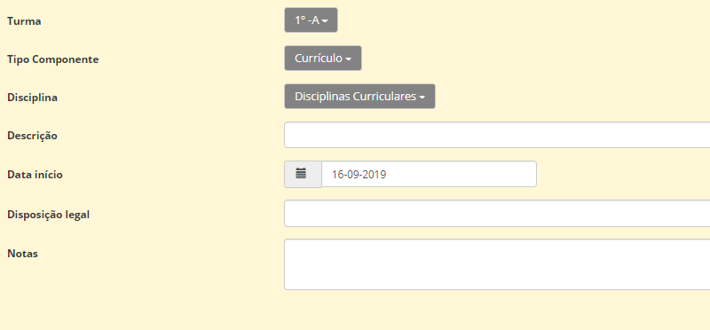
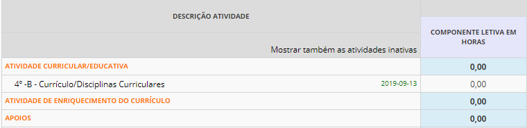

# Horários

“Incumbe às escolas, no âmbito das competências legalmente cometidas aos órgãos de gestão e administração respetivos, proceder à organização e distribuição do serviço docente em sede das componentes letiva e não letiva, em quaisquer das suas modalidades (…)”

                                                                Despacho n.º 143/2013

Para este novo ano letivo, a Plataforma Place sentiu necessidade de reajustar e reorganizar o programa dos horários, de forma a dar resposta às escolas e às entidades responsáveis pela gestão do pessoal docente. 

Segundo a legislação em vigor (Despacho nº143/2013), no horário de trabalho do pessoal docente é  obrigatoriamente registada a **totalidade das horas** correspondentes à duração da respetiva prestação semanal de trabalho, com exceção da componente não letiva destinada a **trabalho individual** e da participação em reuniões de natureza pedagógica.

A organização do horário semanal dos docentes da pré-escolar e 1.º ciclo do ensino básico faz-se nos seguintes termos:

Antes de iniciarmos a abordagem dos horários, sentímos necessitade de apresentar-vos a [Matriz dos Horários](../../documentos/NovaMatriz.pdf) que sustenta toda a parte legal e prática na construção dos mesmos e em simultâneo os [Cargos](../../documentos/cargos.pdf), construídos e enquadrados com base nas necessidades e interesse das escolas da região. 

Desta forma, comecemos por aceder ao separador dos **Docentes**, clicar em cima da nome da docente que queremos trabalhar: 

São apresentadas várias atividades legisladas para a construção do horário do professor, nas quais, as escolas irão completar de acordo com a gestão interna. 

Vamos exemplificar o caso da ***Atividade curricular/educativa***:

Neste campo escolhemos:
- Turma
- Tipo de componente 
- Disciplinas
- Data de início (Muito importante por causa da **geração de sumários**)

No que diz respeito à **descrição e às notas**, estas são **facultativas** para as escolas. 

Este procedimento aplica-se exatamente igual a todas as outras atividades presentes na construção dos horários dos docentes e das turmas. 

No que concerne aos: 

- Projetos
- Clubes
- Vigilâncias (aplica-se apenas ao 1º ciclo)

> [!IMPORTANT]  
> Deve aceder (no separador dos docentes) ao menu (canto superior direito) e clicar em **Atividades/definições** para poder definir inicialmente os projetos, clubes e vigilâncias. 

No que respeita aos **Cargos**, sendo a atividade que mais suscita dúvidas aos criadores dos horários, já se encontram **todos** pré-definidos, devendo ser selecionados de acordo com o pretendido.

> [!TIP]  
> Recomendamos a utilização da pesquisa por texto, de modo a filtrar os cargos disponíveis e facilitar a seleção.

> [!IMPORTANT]  
> **Para os apoios, atividades de enriquecimento do currículo e OTL, a escolha da turma é opcional.**

Os cargos que contêm a sigla EE no início destinam-se ao Ensino Especial.

Ao preenchermos os cargos, é importante definir onde se enquadra a carga horária atribuída à respetiva atividade, colocando um "visto" em cima do quadradinho respetivo. (Apenas estão disponíveis as opções válidas).

Quando as atividades estiverem todas bem definidas no perfil do professor (separador atividades), está na altura de desenhar o horário.

> [!WARNING]  
> Se for **Atividade Curricular/Educativa**, o horário é desenhado no **horário da turma**. As restantes atividades são desenhadas no **horário do professor**.

Já no separador **horários** (tanto da turma como do professor), devemos clicar em **Editar** e aqui começamos a preencher os dados importantes: 
- Dia
- Horário
- Atividade 
- Sala

Neste sentido, cabe às escolas ajustar pontualmente os horários dos docentes às necessidades escolares que ocorram ao longo do ano letivo, de forma a ser mantida a totalidade da carga horária das componentes letiva e não letiva.

Tendo em conta o atraso na disponibilização dos horários, pedimos que às escolas que entrem em contato com o Place (Via email) de forma a solicitar a geração das ocorrências (sumários) deste o início do ano letivo (Referir o dia de início). É igualmente importante salientar o tempo que a escolas pretendem que os sumários fiquem abertos (dias, uma semana, duas semanas...).

> [!CAUTION]  
> Informamos que, neste momento, os totalizadores das horas ainda não estão totalmente operacionais. 

